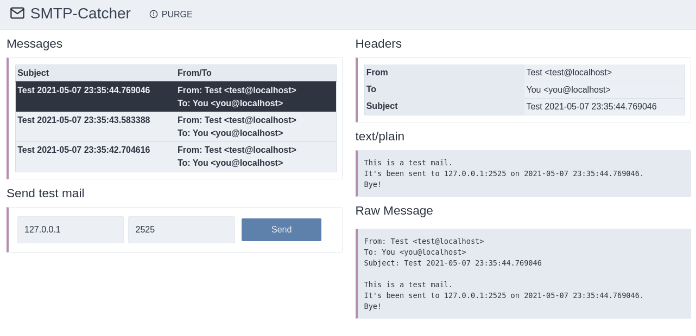

# SMTP-Catcher

This project implements two services:
- Catch all SMTP messages on a port (default 2525)
- Display the catched messages in a webpage (default on port 8080)

You may simply run the two shell-scripts:

```sh
./run_smtp.sh
./run_http.sh
```

It will give you a web interface on [http://127.0.0.1:8080/](http://127.0.0.1:8080/) .

And this is, how it looks like:



## Requirements

It works with python3.6 upward. It's been tested only with python3.9 .

It requires not external libraries except bottle.py. A version of bottle.py is included.
